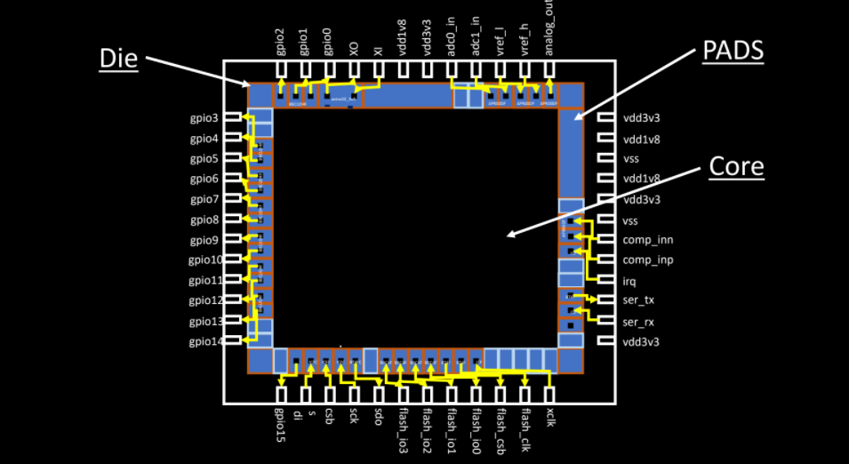

# PhysicalDesign_Workshop
A tour to the world of Physical Design using open-sourced EDA tools

## **ABOUT:** 

This workshop basically walks us through the various steps involved in the Physical Design Flow of an SOC design, also introducing  the various open-sourced EDA tools involved in each step. It unfolds with the introduction of IC design terminologies, SOC based designs and moves forwards touching the various phases of PD flow starting from synthesis to routing and DRCs.   

## **1. Introduction to IC Design terminology and RISC-V based picoSoc:**
### 1.1 IC design terminologies: 
* **Package:** The package that is taken as an example is the QFN-48 and its size is 7mmx7mm. The QFN here, stands for Quad Flat No-leads and 48 is the total number of pins in the package.
* **Chip:** The chip mainly sits at the centre of the package. The pins of the package are connected to the chip and thus information gets transmitted to and fro from the chip and outer world.
* **Pads:** One of the components of the Chip through which information gets exchanged.
* **Die:** It is the overall area of the chip that gets manufactured on silicon wafer.
* **Core:** Its the area where all the digital logic of the chip is placed.

### 1.2 RISC-V based SOC: 
Each chip has its core, the core considered here is of RISC-V based Soc. 
RISC-V is an instruction set architecture, that helps communicating with the computer. There are many flavours of RISC-V here we will be using rv32, 32 bit instruction set. The  riscv implementation used is picorv32. The picorv32 is open-sourced and is implemented by Clifford Wolf. The picorv32 is used as a component in both picoSoc and the RavenSoc. The difference between the Raven and the pico Soc is the picoSoc is targetted towards the embedded systems and the components such as SRAM is external in RAvenSoc. 

We will be using the picorv32 design for the various stages the Physical Design Flow. 

## 2. Introduction to Open-Source EDA Tools:
### 2.1 Tools used in this workshop:
* yosys: synthesis
* graywolf: placement
* qrouter: routing
* magic: layout tool
* ngspice: circuit simultaion tool
* Opentimer and OpenSTA: STA tool

### 2.2 Introduction to Qflow:
Qflow is a complete tool chain for synthesizing digital circuits starting from verilog source and ending in physical layout for a specific target fabrication process. This tool has a GUI interface that helps connect as well as simplify the process of running synthesis, place and route also generating a specific log file for each step performed. 

For detailed information regarding the Qflow please refer [here](http://opencircuitdesign.com/qflow/) 

## 3. Synthesis 
During the synthesis phase, the .v file that is being received from the front-end design is converted to a gate level netlist. The synthesis phase is a combination of a number of steps transtation + logic optimization + technology mapping => gate level netlist
### 3.1 Lab Instances:  
#### 3.1.1 Preparation:
* technology : 180nm
* verilog source file: picorv32.v
* module name : picorv32

## 4. Floorplaning Considerations
From the netlist generated from the synthesis phase, the following aspects are considered: 
* Width and height of core and die:
* Preplaced cells:
* Decoupling capacitors:
* Power Planing:
* Pin Placement
* Cell Blockage
After considering all this aspects the design gets ready for the Placement and routing phase.
### 4.1 Lab Instances:
For the floorplaning labs, we are placing the clock and the resetn pin at the bottom of the picorv32 design with the utilization factor of 70% and aspect ratio 1 indicating that we are considering a square shape. 

## 5. Placement
In this phase:
* Initially, the gates of the netlist are binded to the standard cells and are placed on the floorplan that was designed considering the parameters mentioned in the previous section
* Optimizing placement, here the repeaters/buffers are inserted based on the estimation of wire length and capacitance.

## 6. Introduction to standard cell libraries
Libraries are common across all the stages of the physical design flow. 
The standard cells included in the library includes
* different functionality
* varying sizes
* different threshold voltages
* different drive strength etc.
### 6.1 Cell Design Flow:
Design of a single cell of the library has the following Flow:
* INPUTS: 
  * PDKs: 
    * DRC and LVS rules: these information is provided by the foundries
    * Spice model Parameters
    * user defined spec: e.g cell height, width, supply voltage, pin locations
* Design Steps: 
  * Circuit design: here we implement the function using the spice simulation 
  * Layout design: euler's path and stick diagram concepts are utilized for layouts 
  * characterization: 
* Outputs:
  * CDL
  * extracted spice netlist
  * timing,noise, power .libs
  
### 6.2 Lab Instances:
**Part 1:** We did ng spice simultaions of a inverter for both dc and transient analysis
* dc: we did it for pmos size 0.5 and 0.75 and observed the shift in the Vm i.e the intersection point of the blue and red lines.
* tran: calculated rise delay for pmos width 0.75

**Part 2:** we did this lab for understanding the layout concepts, ran spice simulation for a implented function this is the pre layout spice simulations (prelayout_spice_1.25, intersection point 1.25, prelayout pulse width ) calculated pulse width.
ran magic file for the same function, calculated the area, extracted the parasitics, and ran post layout spice simulations and calculated the pulse width and compared with the prelayout simulations.

## 7. Timing Analysis using OpenTimer: 
* Introduced to the concept of delay tables. The delay tables contain the delay of a cell w.r.t input slew and output load.
* Set up and hold time w.r.t ideal and real clocks. In the case of real clocks, the concept of clock jitter and clock skew comes to the picture.
* Slack is met when the condition data required - data arrival time is positive i.e. no timing violation.
### 7.1 Lab instances: 
For timing analysis Opentimer tool is used. Steps involed
* create sdc file
* set the sta configuration file
* check the set-up slack and hold slack in reports generated by the tool. 

## 8. Routing and DRC: 
### 8.1 Routing:
* routing means finding the best possible way to connect two components/cells.
* most of the routing tools are based on the Lee's Algorithm. For more info on the algorithm please refer [here](https://www.vlsisystemdesign.com/maze-routing-lees-algorithm/) 
* Routes with minimum amount of bends is prefered by the tool
### 8.2 DRC (Design Rule Check):
* Wires are made using optical lithography techniques so, most of the design rules comes from the lithography point of view. 
* Some of DRC rules for a pair of Wires: 
  * Wire pitch
  * Wire Space
  * Wire Width
* Physical wires have resistance and capacitance and these information are extracted and represented in the form of a file format called **SPEF**
### 8.3 Lab instances:

